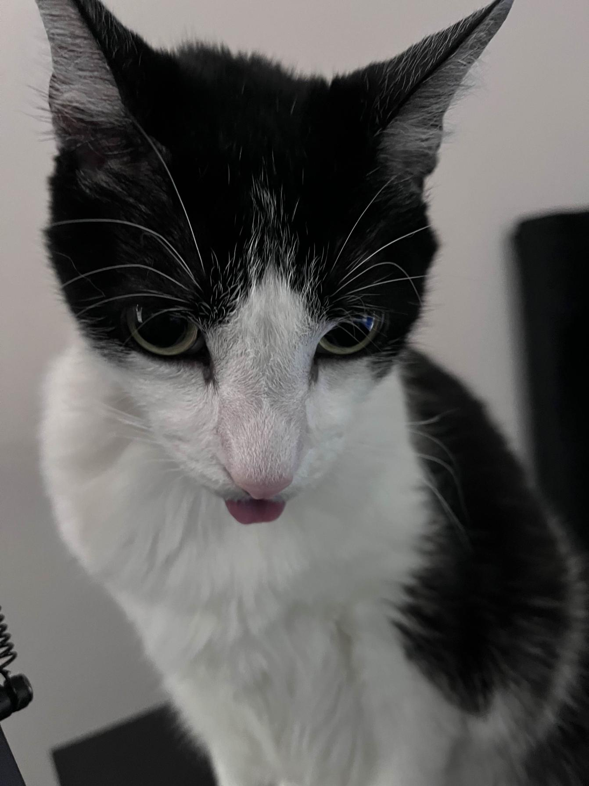

# skatboards

## about me

hii im natalie ! a comp sci student at UCF on the KnightHacks workshop team. we brainstorm, design, plan, and present workshops to 100s of students each semester. im also apart of a BNY intern program to build ai-powered solutions to fintech web apps.  

a big motivation for me in comp sci is gaining a deep understanding of the technologies, concepts, and frameworks i work with so that i can consider myself a resource to others and help uplift them :3

  
<h2> currently </h2>
- planning workshops  
- being an  academic weapon  🤓  
- brainstorming next hackathon projects  

  connect w/ me ! 
  <a href="mailto:natrse@icloud.com">email</a> | <a href="www.linkedin.com/in/nat-reese">linkedin/nat-reese</a>   
  pfp - <a href="https://x.com/sinonomemikann">sinonomemikann</a>
  

---

  
p.s look at my cat his name is snoopy  

